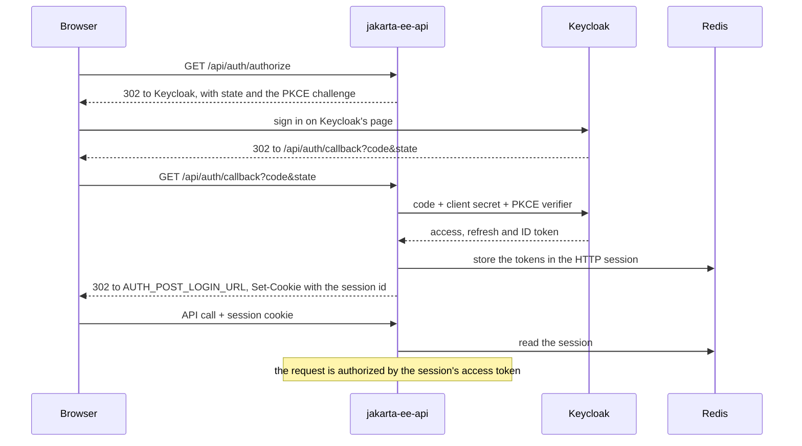

# Authentication

The application never handles a credential. Keycloak (realm `jakarta-ee-api`) owns every page that touches one:
sign-up, sign-in, email verification, password reset, two-factor authentication and acceptance of the terms of use.
The application is a BFF: it runs the sign-in, keeps the tokens on the server and gives the browser only a session
cookie.

## Signing in

1. The browser opens `GET /api/auth/authorize`. `BrowserSessions` stores a fresh `state` and PKCE verifier in the HTTP
   session, and the browser is redirected to Keycloak with the challenge. Optional parameters pass through:
   `register=true` opens the sign-up page, and `kc_action` starts one of `CONFIGURE_TOTP`, `UPDATE_PASSWORD` or
   `delete_credential`. The `Accept-Language` header picks Keycloak's language when it is `pl` or `en`.
2. Keycloak returns to `GET /api/auth/callback`. The application checks that the `state` is the one it issued to this
   browser and `KeycloakTokenClient` exchanges the code with the confidential client and its secret.
3. `SessionService` mirrors the account into MongoDB and the tokens go into the HTTP session; the browser lands on
   `AUTH_POST_LOGIN_URL`. When the account cannot be written, the Keycloak session is ended again. Any failure redirects
   with `?error=sign_in_failed`, and a `state` this browser was not given with `?error=state_mismatch`.

The browser holds only the `JAKARTA_EE_API_SESSION` cookie: `HttpOnly`, `SameSite=Lax`, `Secure` unless
`session_cookie_secure=false` (the local setting).

## Every request is authorized by a token

`KeycloakAuthenticationFilter` takes the access token from `Authorization: Bearer` or, for a browser, from its session.
`TokenVerifier` checks it with Nimbus JOSE + JWT: the signature against Keycloak's published keys, the issuer, the
expiry and the audience (`KEYCLOAK_AUDIENCE`). The roles come from `realm_access.roles`, and the caller becomes the
request's `SecurityContext`, which `RoleAuthorizationFilter` and `@RolesAllowed` read.

Either way the decision rests on the token alone, so any instance can serve any request.

## Sessions and refreshing

The HTTP session lives in Redis, and its access token is refreshed once per refresh token, across instances: [Token
refresh](mechanisms/token-refresh.md).

## Signing out

`POST /api/auth/logout` revokes the refresh token at Keycloak, which ends the Keycloak session, and invalidates the HTTP
session.

## Cross-site requests

An unsafe request from another site gets no token: [Cross-site requests](mechanisms/cross-site-requests.md).

## Code

All in `modules/app/src/main/java/com/vertyll/jakartaeeapi/auth`:

| Class                          | Role                                                                |
|--------------------------------|---------------------------------------------------------------------|
| `AuthResource`                 | authorize, callback, session, logout                                |
| `BrowserSessions`              | what the HTTP session holds: the sign-in in progress and the tokens |
| `SessionService`               | sign-in with the account mirror, refresh, sign-out                  |
| `KeycloakTokenClient`          | code exchange, refresh, revocation                                  |
| `SharedRefreshes`              | one refresh per refresh token across instances                      |
| `TokenVerifier`                | token verification against Keycloak's keys                          |
| `KeycloakAuthenticationFilter` | turning a bearer token or a session into a caller                   |
| `RoleAuthorizationFilter`      | `@PermitAll`, `@DenyAll`, `@RolesAllowed`                           |
